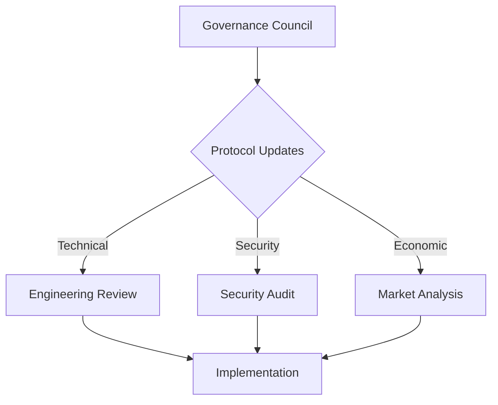

# Quantum Entanglement Navigation Network (QENN)

## System Architecture

A decentralized network utilizing quantum entanglement for precise interstellar navigation, combining blockchain technology with quantum mechanics principles.

### Core Components

#### 1. Quantum Beacon Network
```
├── Primary Beacons
│   ├── Ground Stations
│   │   ├── Entanglement Generation
│   │   └── Error Correction Systems
│   └── Space-Based Relays
│       ├── Orbital Arrays
│       └── Deep Space Stations
└── Secondary Systems
    ├── Decoherence Monitoring
    └── Synchronization Protocol
```

#### 2. Navigation Infrastructure
```solidity
contract BeaconRegistry {
    struct Beacon {
        uint256 beaconId;
        bytes32 quantumSignature;
        uint16 coherenceQuality;
        address operator;
        NavigationChannel[] channels;
    }
    
    struct NavigationChannel {
        uint256 channelId;
        uint256 primaryBeaconId;
        uint256 secondaryBeaconId;
        uint32 precision;
        bool active;
    }
}
```

### Quantum Navigation Protocol

#### 1. Entanglement Distribution
- Multi-stage quantum state preparation
- Error-resistant encoding schemes
- Real-time decoherence compensation
- Hierarchical beacon synchronization

#### 2. Position Determination
```
Position Accuracy = Base Precision * (1 / Decoherence Factor) * Network Density
Navigation Quality = ∑(Beacon Strength * Channel Quality) / Distance Factor
```

### Technical Specifications

#### Quantum Systems
1. Entanglement Generation
    - Type-II parametric down-conversion
    - High-fidelity Bell state preparation
    - Quantum memory integration

2. Error Correction
    - Surface code implementation
    - Dynamic error threshold adaptation
    - Multi-round purification protocol

#### Blockchain Integration

```
├── Smart Contracts
│   ├── BeaconManagement.sol
│   ├── NavigationToken.sol
│   ├── PrecisionMarket.sol
│   └── GovernanceSystem.sol
├── Oracle Network
│   ├── QuantumStateOracle.sol
│   └── PositionVerification.sol
└── Data Management
    ├── EntanglementRegistry
    └── NavigationLogs
```

### Navigation Channels

#### Channel Types
1. Primary Navigation
    - High-precision entangled pairs
    - Redundant backup systems
    - Real-time correction capability

2. Secondary Navigation
    - Regional coverage networks
    - Lower precision tolerance
    - Higher refresh rate

#### Quality Metrics
```
Channel Quality = Entanglement Fidelity * Signal Strength * Update Frequency
System Reliability = ∑(Channel Quality) * Network Redundancy
```

### Spacecraft Integration

#### Hardware Requirements
1. Quantum Receivers
    - Cryogenic cooling systems
    - High-sensitivity detectors
    - Noise isolation mechanisms

2. Processing Units
    - Real-time state estimation
    - Trajectory calculation
    - Error compensation

#### Software Stack
```
├── Core Navigation
│   ├── Quantum State Processing
│   ├── Position Calculation
│   └── Trajectory Optimization
├── Blockchain Interface
│   ├── Smart Contract Integration
│   └── Data Verification
└── Control Systems
    ├── Automated Corrections
    └── Manual Override
```

### Governance Structure

#### Beacon Deployment
1. Site Selection
    - Optimal coverage analysis
    - Interference mapping
    - Redundancy planning

2. Operation Protocol
    - Maintenance schedule
    - Performance monitoring
    - Upgrade coordination

#### Network Management


### Economic Model

#### Token Utility
- QNAV (Quantum Navigation) governance token
- Precision improvement rewards
- Beacon operation incentives

#### Market Dynamics
```
Service Fee = Base Rate * (Precision Level + Channel Quality)
Operator Reward = Channel Usage * Performance Metric * Stake Amount
```

### Security Measures

#### Quantum Security
1. Anti-Spoofing
    - Quantum signature verification
    - Channel authentication
    - State validation

2. Decoherence Protection
    - Environmental shielding
    - Dynamic recalibration
    - Redundant encoding

#### Classical Security
- Multi-signature authorization
- Encrypted classical channels
- Distributed consensus mechanisms

### Future Development

#### Phase 1: LEO Network
- Earth orbital beacon deployment
- Initial navigation protocols
- Basic spacecraft integration

#### Phase 2: Solar System
- Planetary beacon placement
- Enhanced precision systems
- Advanced decoherence compensation

#### Phase 3: Interstellar
- Deep space beacon network
- Quantum repeater integration
- Long-distance navigation protocols

## Technical Considerations

### Performance Metrics
1. Position Accuracy
    - Sub-kilometer precision in deep space
    - Millisecond temporal resolution
    - Six-degree freedom tracking

2. System Reliability
    - 99.999% uptime guarantee
    - Real-time redundancy
    - Automatic failure recovery

### Environmental Factors
1. Space Environment
    - Radiation protection
    - Temperature stabilization
    - Gravitational compensation

2. Quantum Effects
    - Decoherence mitigation
    - Entanglement preservation
    - State fidelity maintenance

## Conclusion

The Quantum Entanglement Navigation Network represents a revolutionary approach to interstellar navigation, combining quantum mechanics with blockchain technology to create a robust and precise navigation system for deep space exploration.
